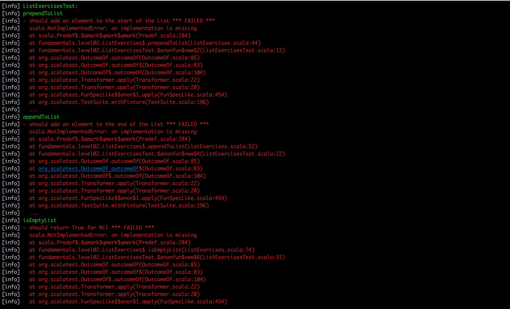
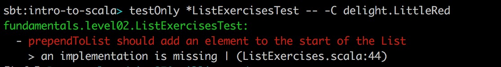
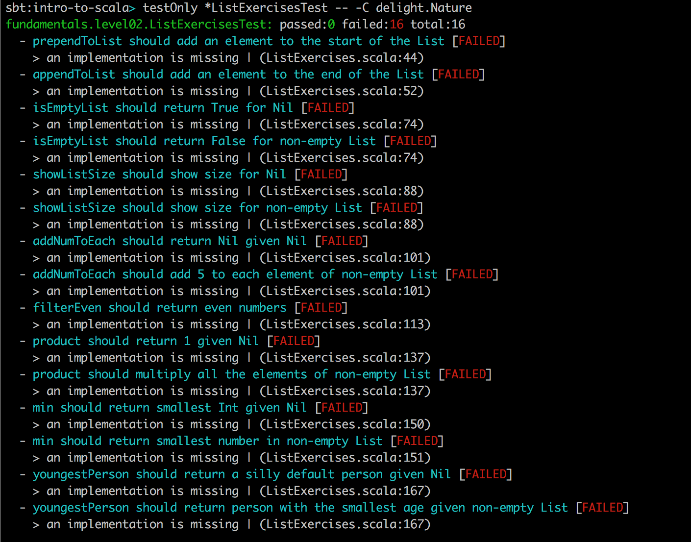
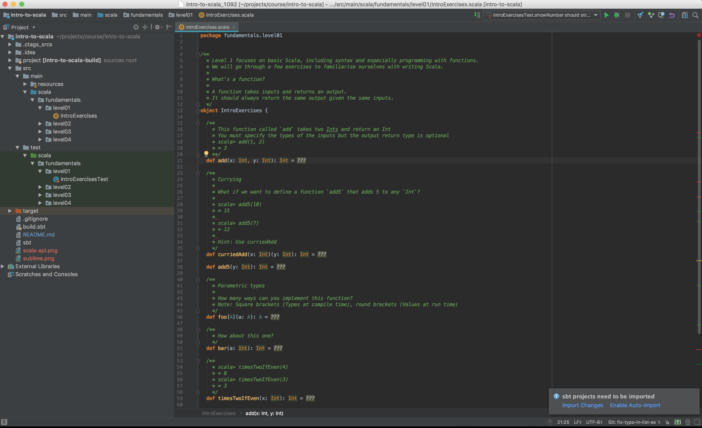
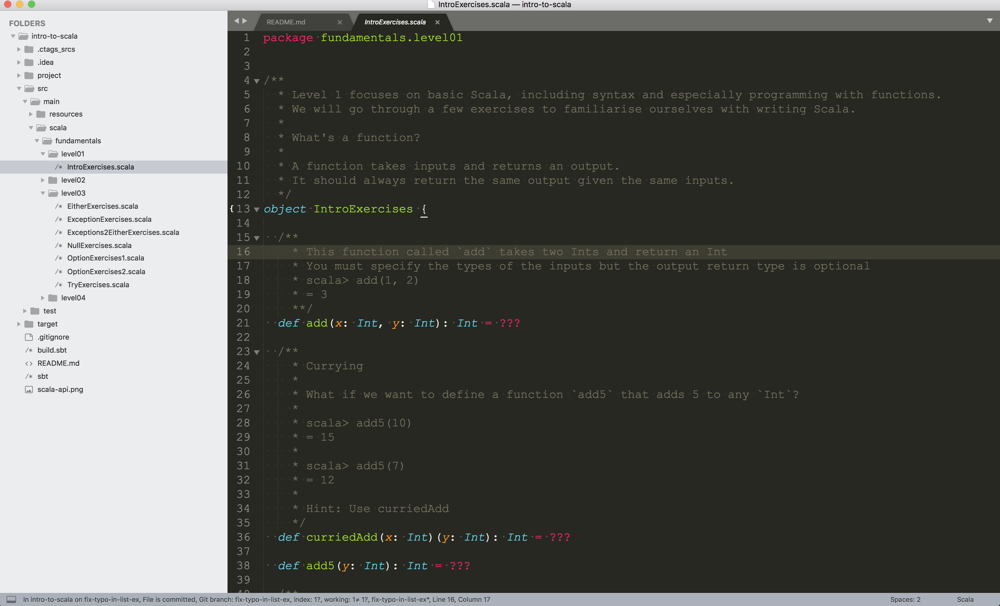
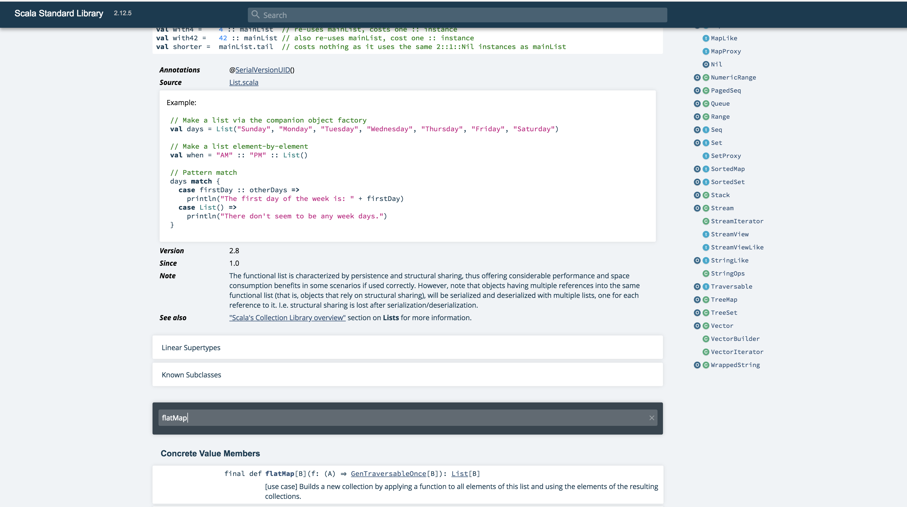

# Intro to Scala Fundamentals

[](https://travis-ci.org/wjlow/intro-to-scala)

This is a two day course. You are expected to know how to program in at least one programming language (Java, Ruby, JavaScript, etc.). The course teaches the fundamentals of using Scala as a functional programming language.

This course is meant to be run in person. There are comments in the exercises to try and point you in the right direction so you should be able to do this in your spare time if you desire. Unit tests are included to verify your solutions for each exercise.

Use `./auto/sbt test` to run the tests. The first time you run the tests, they will all fail. This is a good thing! As you complete each exercise correctly, the tests will pass.

We welcome pull requests and feedback!

## Schedule

### Day 1

| Time | Topic/Exercise | 
| :---: | :---: | 
| 09.00 | Start | 
| 09.15 | Intro to FP/Scala |
| 10.00 | IntroExercises | 
| 10.45 | Morning break | 
| 11.00 | Intro to ADTs |
| 11.15 | TypesExercises | 
| 12.15 | Lunch | 
| 13.30 | ListExercises |
| 15.15 | Afternoon break |
| 15.30 | NullExercises |
| 16.00 | OptionExercises pt. 1 (Safe constructors) |
| 16.30 | OptionExercises pt. 2 (first half) | 
| 17.00 | End | | |

### Day 2

| Time | Topic/Exercise |
| :---: | :---: | 
| 09.15 | Intro to Error Handling |
| 10.00 | OptionExercises pt. 2 (second half) | 
| 10.30 | Morning break | 
| 10.45 | OptionExercises pt. 3 | 
| 11.30 | ExceptionExercises | 
| 12.15 | Lunch | 
| 13.15 | Exceptions2EitherExercises | 
| 14.30 | TryExercises | 
| 15.00 | Afternoon break | 
| 15.30 | LogParser | 
| 16.45 | Wrap up | 
| 17.00 | End | 

## Pre-requisites

At a minimum, you need:

- This repository
- Java 11 installed (even if you have a newer version)
- Docker
- Text editor (IntelliJ is recommended)

#### 1. Fork or clone this repository

```
$ git clone https://github.com/wjlow/intro-to-scala.git
$ cd intro-to-scala/
```

#### 2. Install Java 11 (even if you already have a later version pre-installed)

Test if you have Java 11 already with `java -version`.

##### macOS (using [Homebrew](https://brew.sh))

Run the following two commands:

```
$ brew tap AdoptOpenJDK/openjdk
$ brew cask install adoptopenjdk11
```

#### 3. Install [Docker](https://www.docker.com/)

##### macOS

Use [Docker for Mac](https://docs.docker.com/docker-for-mac/install/)

#### 4. Run SBT through Docker

To run the `sbt` shell using Docker:

```
$ ./auto/sbt
```

__Tip__: Launching SBT might take some time, so we recommend using SBT's interactive shell to run commands, instead of lauching SBT for each command.

#### [5. Compile program to resolve dependencies before the course](#compilation)

#### [6. IDE setup](#ide-setup)

## Compilation

Launch the SBT shell.

To only compile production code use:

```
sbt> compile
```

To compile production and test code use:

```
sbt> test:compile
```

## How to run tests

### To run all tests

To run all tests use:

```
sbt> test
```

The first time you run all the tests you will get a lot of errors! These tests will be fixed by you during the duration of the course.

### Running a single test file

In the meantime, run only a single test case at a time to keep things manageable.

To run a single test, use:

```
sbt> ~testOnly package.path.of.test.TestName
```

For example, to run only the _introcourse.level01.IntroExercisesTest_ test case, use:

```
sbt> ~testOnly introcourse.level01.IntroExercisesTest
```

To run by test case name only, use:

```
sbt> ~testOnly *TestName
```

For example, to run the _introcourse.level01.IntroExercisesTest_ test case, use:

```
sbt> ~testOnly *IntroExercisesTest
```

The `~` watches for changes to your files and runs the command automatically. It's nice to use it to get really fast feedback as you are working on the exercises!

To stop watching changes through `~`, press <kbd>Enter</kbd> to return to the SBT shell prompt.

<details><summary>Reducing StackTraces Shown by Failed Tests</summary>

<p>
<p>
The first time you run a test case you will be greeted by a long list of StackTraces:



If you want to see all tests that pass and only the first test that fails use the *LittleRed* reporter with:

```
testOnly *TestName -- -C delight.LittleRed
```




If you want to see all passing and failing tests with minimal stacktraces use the *Nature* reporter with:


```
testOnly *TestName -- -C delight.Nature
```



For more information see [Delight](https://github.com/ssanj/delight)

</p></p>
</details>

## Jumping into a Scala REPL

To launch into a Scala REPL with all production code use:

```
sbt> console
```

Once in the console, you can import your production code as such:

```
import package.objectname._
```

For example, to use functions defined in _introcourse.level01.IntroExercises_:

```
scala> import introcourse.level01.IntroExercises._
scala> add(1, 2)
res0: Int = 3
```

To launch into a Scala REPL with all production and test code use:

```
sbt> test:console
```

Type `:q` to exit from the REPL and return to SBT.

## Exiting SBT

To exit the SBT shell use:

```
sbt> exit
```

## IDE setup

<details><summary>IntelliJ IDEA (recommended)</summary>



<p>

1. [Download IntelliJ (free Community edition is fine)](https://www.jetbrains.com/idea/download/#section=mac)

2. Install and open IntelliJ

3. If running IntelliJ for the very first time, it might ask you what "featured" plugin you want to install. Select _Install_ for Scala, otherwise install manually: _Configure -> Plugins -> Browse Repositories -> Scala_

4. Restart IntelliJ to activate the plugin

5. Open IntelliJ and open this project: _Open -> Select directory where project is in_

6. IntelliJ will detect this as an SBT project. Select `Import SBT Project` when prompted

7. In the pop-up, choose _SDK -> JDK -> Java 11_. If Java 11 is not available, add it by selecting _New..._ to the right of _Project JDK_, then _+JDK_, then `/Library/Java/JavaVirtualMachines/adoptopenjdk-11.jdk` and finally _Open_

8. Wait for IntelliJ to refresh the project and download dependencies (this might take a while)

9. Build the project with <kbd>Cmd</kbd> + <kbd>F9</kbd>. If you get no errors, IntelliJ setup is all done!

Tips:

* You can run individual tests by right-clicking and then selecting _Run ...ExercisesTest_ ([or just use SBT](#how-to-run-tests))

* Use <kbd>Cmd</kbd> + <kbd>P</kbd> inside the argument of a function to see what type the argument needs to be.

* Use <kbd>Ctrl</kbd> + <kbd>Shift</kbd> + <kbd>P</kbd> to find out the type of a highlighted expression.

</p></details>

<details><summary>Text Editor (Vim/Sublime/Atom/Emacs)</summary>



<p>

1. Open the current directory in an editor of your choice.

2. Open the SBT shell in a terminal window.

3. Compiling - [See SBT instructions on how to compile code](#compilation).

4. Running Tests - [See SBT instructions on how to run tests](#how-to-run-tests).

5. Looking up Scala API - You can also search through the [Scala APIs](https://www.scala-lang.org/api/current/) to find any necessary methods or use a documentation browser like [Dash](https://kapeli.com/dash).

6. To explore the Scala API or any of the exercises use the Scala REPL - [See SBT instructions on how to jump into the REPL](#jumping-into-a-scala-repl).



</p></details>

## Further documentation

- [Scala API](https://www.scala-lang.org/api/current/)
- [SBT 1.x](https://www.scala-sbt.org/1.x/docs/index.html)
- [ScalaTest 3.x](http://doc.scalatest.org/3.0.0/index.html#org.scalatest.fixture.FunSpec)
- [Scalactic 3.x](http://doc.scalactic.org/3.0.0/index.html#org.scalactic.TypeCheckedTripleEquals)
